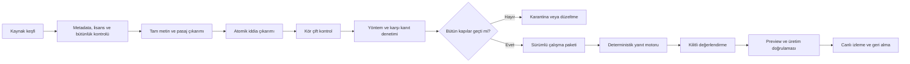

<!--
Authority: user-approved DNA Intelligence V3 production plan
Source thread: 019f66f2-c030-7c82-9103-77e260a5fd08
Source turn: 019f773a-b432-7493-9d88-cc5164f16f32
Captured: 2026-07-19
Execution rule: phases 0-60 are serial; a phase closes only after its exit gates and evidence checkpoint pass.
-->
# DNA Intelligence V3 — Baştan Sona Üretim Planı

Bu sürecin dış bilimsel kaynak, katalog, doğrulama, test ve canlıya alma tarafını üstlenebilirim. DNA’nın kendi kavramsal kitabını sen onaylayacaksın; diğer kaynakları ben çok katmanlı denetimden geçirerek yöneteceğim.

Ancak önemli bir sınırı dürüstçe koyuyorum: Aynı yapay zekânın birkaç farklı kontrolden geçmesi, bağımsız insan uzman incelemesiyle aynı değildir. Bu nedenle hiçbir içeriği “uzman onaylı” diye etiketlemeyeceğiz. Doğru ifade:

> Çok katmanlı kaynak, yöntem, güvenlik ve tutarlılık denetiminden geçmiş.

Sistemi bu açığı telafi edecek şekilde **fail-closed** kuracağız: Emin olmadığımız, kaynakta açıkça bulunmayan, çelişkili veya yöntemsel olarak zayıf bilgi yayımlanmayacak. Sistem gerektiğinde “yeterli kanıt yok” diyecek.

Bu plan takvim değil, **kalite kapısı temelli** olacak. Bir fazın çıkış koşulları tamamen geçmeden sonraki faz yayın sürecine giremeyecek.

---

## Nihai ürün hedefi

Ortaya çıkacak ürün:

- Haricî LLM veya model API’si kullanmayacak.
- Çalışma zamanında internete çıkmayacak.
- Embedding veya vektör veritabanı gerektirmeyecek.
- Bilimsel cevapları gerçek kaynak pasajlarına bağlayacak.
- Kısa, standart ve derin cevap verebilecek.
- Türkçe yazım hataları, eş anlamlılar, takip soruları ve birleşik soruları anlayabilecek.
- Rapor bulgusu ile genel teoriyi birbirinden ayıracak.
- Tanı, tedavi, ilaç, prognoz ve doğrudan biyolojik mekanizma üretmeyecek.
- Her sürümde hangi bilgiyi, hangi kaynakla, hangi testlerle sunduğunu kanıtlayabilecek.
- Problemli bir kaynak veya sürüm anında devreden çıkarılabilecek.
- “DNA Intelligence” adı altında ölçülebilir ve dürüst biçimde ürünleştirilebilecek.

Temel mimari:



---

# PROGRAM 1 — YÖNETİŞİM VE BİLGİ OTORİTESİ

## Faz 0 — Mevcut sistemi dondurma

Mevcut çalışan sürüm, yeni sistem için geri dönüş noktası olacak.

Başlangıç envanteri:

- 118 konu
- 239 canlı iddia
- 166 tek adımlı ilişki
- 160 kaynak kaydı
- 43 güvenlik kuralı
- 1.856 benchmark sorusu
- 928 internal holdout sorusu
- 2.703 ham araştırma kaydı
- Mevcut deterministik ve güvenlik testleri

Yapılacaklar:

- Mevcut katalog ve motor dosyalarının hash’leri kaydedilecek.
- Mevcut cevaplardan sürümlü regresyon örnekleri oluşturulacak.
- V2 motoru silinmeyecek; V3 için geri dönüş seçeneği olarak tutulacak.
- Kullanıcının ilgisiz çalışma ağacı değişiklikleri entegrasyona alınmayacak.
- Başlangıç test sonuçları bir `baseline-manifest` dosyasına bağlanacak.

Çıkış kapısı:

- Katalog, reasoning, security, determinism, quality, API, lint ve build testlerinin tamamı geçmeli.
- Başlangıç sürümü tek komutla yeniden üretilebilmeli.
- Rollback sürümü açıkça tanımlanmalı.

---

## Faz 1 — Amaçlanan kullanım sözleşmesi

Ürünün ne olduğu koddan önce kesinleştirilecek.

DNA Intelligence şunları yapabilecek:

- Nörofizyolojik ve düzenleme kavramlarını açıklamak
- Kavramları karşılaştırmak
- Kanıt durumunu aktarmak
- Yaş ve örneklem sınırlarını göstermek
- DNA konseptiyle kavramsal bağlantıyı açıklamak
- Seçilmiş rapordaki güvenli bulguları tartışmak
- Rapor bulgusu ile genel literatürü yan yana getirmek
- Kaynakları göstermek
- Bilgi bulunamadığında bunu açıkça söylemek

Şunları yapamayacak:

- Tanı ve ayırıcı tanı
- Tedavi veya seans planı
- İlaç ve doz önerisi
- Prognoz
- Kesin nedensellik
- Davranıştan beyin bölgesi, HRV, kortizol veya otonom durum çıkarma
- Ham cevap, anamnez, trace veya gizli kuralları gösterme
- Başka terapistin vakasını görüntüleme
- Raporlar arasında karşılaştırmalı klinik profil çıkarma
- Kendiliğinden yeni bilgi öğrenme

WHO ve NIST sağlık alanındaki AI sistemlerinde amaçlanan kullanımın, bilgi sınırlarının, test süreçlerinin ve yaşam döngüsü izlemesinin açıkça belgelenmesini öneriyor. [WHO AI for Health](https://www.who.int/publications/i/item/9789240078871), [NIST AI RMF Core](https://airc.nist.gov/airmf-resources/airmf/5-sec-core/)

Çıkış kapısı:

- Her desteklenen ve yasak davranış otomatik teste bağlanmalı.
- Arayüz, API ve pazarlama metni aynı kullanım sınırını taşımalı.

---

## Faz 2 — Dört ayrı bilgi otoritesi

Bilgiler birbirine karıştırılmayacak.

| Katman | Otorite | Onay biçimi |
|---|---|---|
| DNA Ürün Bilgisi | Senin onayladığın DNA kitabı | `owner_approved` |
| Dış bilimsel bilgi | Hakemli yayınlar, kılavuzlar, kitaplar | `codex_multi_pass_audited` |
| Vaka bilgisi | Yapılandırılmış güvenli rapor bağlamı | `report_derived` |
| Güvenlik ve ürün sınırları | Sürümlü güvenlik sözleşmesi | `policy_enforced` |

Kurallar:

- DNA kitabı dış bilimin yerine geçemez.
- Genel literatür DNA’nın bilimsel geçerliğini otomatik olarak kanıtlayamaz.
- Vaka raporu biyolojik mekanizma ölçümü gibi sunulamaz.
- Ürün güvenlik kuralı, kaynakta geçen bir ifadeyle aşılamaz.
- Dış bilim DNA ürün tanımını kendi kendine değiştiremez.

---

## Faz 3 — DNA kitabının kilitlenmesi

Senin kontrol edeceğin kitap için:

- Her bölüm benzersiz bölüm kimliği taşıyacak.
- Kitabın sürümü ve SHA-256 hash’i kaydedilecek.
- Onaylanan bölüm aralıkları ayrıca listelenecek.
- Her DNA iddiası bir bölüm ve pasajla bağlanacak.
- Kitap değişirse önceki onay otomatik olarak geçersiz olacak.
- “DNA kitabında yazıyor” ile “bilimsel olarak doğrulanmıştır” birbirinden ayrılacak.

DNA’ya özel psikometrik geçerlik, güvenirlik, faktör yapısı, ölçüm değişmezliği ve dış ölçüt geçerliği ancak DNA üzerinde yapılacak gerçek araştırmalarla gösterilebilir. Genel nörofizyoloji kaynakları bunu sağlayamaz.

Çıkış kapısı:

- Canlıdaki her DNA ürün iddiası, onaylanmış kitap sürümüne bağlı olmalı.
- Onaylanmamış yeni bölüm otomatik olarak çalışma paketinin dışında kalmalı.

---

## Faz 4 — İçerik yaşam döngüsü

Her kaynak ve iddia şu süreçten geçecek:

```text
discovered
→ screened
→ licence_cleared
→ integrity_cleared
→ acquired
→ parsed
→ appraised
→ claim_extracted
→ independently_rechecked
→ accepted | contested | quarantined
→ compiled
→ released
→ monitored
→ deprecated | withdrawn
```

Canlı sisteme yalnız `released` durumundaki kayıt girecek.

`pending`, `contested`, `quarantined`, `reference_only`, `metadata_only` veya `restricted` durumundaki içerik hiçbir kullanıcı cevabını destekleyemeyecek.

---

# PROGRAM 2 — KAPSAM VE KAYNAK STRATEJİSİ

## Faz 5 — Bilgi haritasının tamamlanması

Ana kapsam en az şu 10 bilimsel alanda yönetilecek:

1. Hücresel nörofizyoloji
2. Merkezi sinir sistemi ve ağlar
3. Otonom sinir sistemi ve HRV
4. Stres, uyarılma, reaktivite ve toparlanma
5. İnterosepsiyon ve duyusal süreçler
6. Duygusal düzenleme, öz-düzenleme ve eş-regülasyon
7. Dikkat, çalışma belleği ve yürütücü işlevler
8. Uyku ve sirkadiyen süreçler
9. Gelişim ve nörogelişimsel farklılıklar
10. Ölçüm, vaka yorumu ve klinik sınırlar

Her alan aşağıdaki boyutlarda parçalanacak:

- Tanım
- Anatomi
- İşlev
- Gelişim
- Ölçüm
- Kanıt düzeyi
- Tartışmalı teoriler
- Yaş kapsamı
- Tipik gelişim
- Nörogelişimsel farklılıklar
- DNA ile ilişki
- Vaka yorum sınırları
- Yanlış bilinenler
- Bilinmeyenler

Çıkış kapısı:

- Her kategori için kapsam matrisi bulunmalı.
- “Kaynağımız var” değil, “hangi soruları güvenle cevaplayabiliyoruz?” gösterilmeli.

---

## Faz 6 — Boşluk odaklı kaynak arama

Kaynaklar rastgele çoğaltılmayacak. Önce mevcut boşluklar çıkarılacak.

Örnek eksik alanlar:

- İyon kanalları, sinaptik plastisite, glia ve nöromodülatörler
- Beyin sapı, talamus, bazal gangliyonlar ve serebellum
- Merkezi otonom ağ, barorefleks, solunum ve postür etkileri
- HPA/SAM sistemleri ve çocuk–ergen stres gelişimi
- Vestibüler, proprioseptif, dokunsal ve işitsel modülasyon
- Eş-regülasyonun gelişimsel ve kültürel sınırları
- Yürütücü işlevlerde görev saflığı problemi
- Pediatrik uyku ve sirkadiyen gelişim
- ADHD, DCD, disleksi, dil bozuklukları, Tourette ve yetişkin nöroçeşitliliği
- DNA’ya özgü psikometri ve bireysel belirsizlik

Her boşluk için arama protokolü hazırlanacak:

- Araştırma sorusu
- Dahil etme koşulları
- Dışlama koşulları
- Yaş grubu
- Çalışma türü
- Tarih kesme noktası
- Kullanılan veri tabanları
- Tam arama ifadeleri
- Sonuç ve dışlama sayıları

PRISMA burada “ürün doğruluğu sertifikası” olarak değil, kaynak arama ve seçim sürecini yeniden üretilebilir kılmak için kullanılacak. [PRISMA 2020](https://www.prisma-statement.org/prisma-2020)

---

## Faz 7 — Kaynak öncelik sırası

Her soru türü için farklı kaynak sınıfı önceliklendirilecek.

### Tanım ve genel çerçeve

- Resmî standart veya konsensüs
- Güncel temel ders kitabı
- Güçlü narrative review

### İlişki ve sonuç

- Sistematik derleme
- Meta-analiz
- Birden fazla bağımsız yüksek kaliteli çalışma

### Ölçüm

- Güvenirlik
- Yapı ve ölçüt geçerliği
- Ölçüm değişmezliği
- Standart hata
- Norm çalışmaları
- Test-tekrar test

### Mekanizma

- Doğrudan insan verisi
- Uygun deneysel tasarım
- Bağımsız tekrar
- Hayvan ve insan kanıtlarının açık ayrımı

### Teoriler

- Kurucu yayın
- Destekleyen kanıtlar
- Eleştiriler
- Alternatif açıklamalar
- `theory_only` veya `contested` etiketi

Kaynak sınıfları:

- A: Kılavuz, konsensüs, güçlü sistematik sentez
- B: Güçlü birincil araştırma
- C: Ders kitabı veya narrative review
- D: Teori yazısı, white paper veya preprint
- E: Blog, pazarlama metni, sosyal medya

E sınıfı canlı bilimsel iddia kaynağı olamayacak.

---

## Faz 8 — Kaynak kimliği ve tekilleştirme

Her kaynak için:

- DOI
- PMID
- PMCID
- ISBN
- Başlık
- Yazarlar
- Yıl
- Dergi/kurum
- Yayın sürümü
- Düzeltme durumu

kontrol edilecek.

Kurallar:

- DOI kanonik biçime dönüştürülecek.
- Aynı çalışmanın preprint, makale ve düzeltme sürümleri ayrı kanıt sayılmayacak.
- Aynı çalışmadan çıkan çoklu yayınlar birbirine bağlanacak.
- Yinelenen DOI/PMID çalışma paketini durduracak.
- Başlık–DOI–yıl tutarsızlığı otomatik hata olacak.

---

## Faz 9 — Lisans kontrolü

Kaynağın bulunabilir olması, içeriğinin yeniden dağıtılabileceği anlamına gelmez.

Her kaynak ve her bileşen için:

- Ticari kullanım
- Uyarlama
- Metin madenciliği
- Yeniden gösterim
- Tablo/şekil/ölçek lisansı
- Ayrı üçüncü taraf materyal

kontrol edilecek.

Genel politika:

- CC0 / CC BY: uygun
- ShareAlike: koşullu
- NC / ND: çalışma paketine göre kısıtlı
- Tüm hakları saklı: metadata veya kısa doğrulama kullanımı; tam metin runtime’a girmez
- Ölçek, form, test, soru listesi, tablo ve şekiller varsayılan olarak dışarıda

Çıkış kapısı:

- Lisansı belirsiz hiçbir pasaj yayınlanmayacak.
- Metadata-only kaynak, canlı iddia desteği olamayacak.

---

## Faz 10 — Kaynak bütünlüğü ve geri çekilme kontrolü

Her kaynak için:

- Retraction
- Expression of concern
- Correction
- Erratum
- Superseded sürüm
- Başlık/DOI sahteciliği
- Dergi ve yayıncı tutarlılığı

kontrol edilecek.

Crossref’in Retraction Watch ve Crossmark altyapıları düzeltme ve geri çekilme denetiminde kullanılabilir. [Crossref Retraction Watch](https://www.crossref.org/documentation/retrieve-metadata/retraction-watch/), [Crossmark](https://www.crossref.org/services/crossmark/)

Kural:

- Geri çekilmiş kaynak otomatik karantinaya alınır.
- Ona bağlı `source → passage → claim → relation → answer` zinciri bulunur.
- Güvenli alternatif yoksa sistem o konuda `not_available` döndürür.
- Geçmiş kayıt silinmez; `withdrawn` olarak saklanır.

---

## Faz 11 — Kaynak edinme ve SSD arşivi

Ham veri ResearchSSD’de tutulacak:

```text
/Volumes/ResearchSSD/Datasets/SelfMetaAI/dna-knowledge/source-library
/Volumes/ResearchSSD/Datasets/SelfMetaAI/dna-knowledge/work
/Volumes/ResearchSSD/Outputs/SelfMetaAI/dna-intelligence/releases/<version>
```

Her indirme için:

- Kaynak URL’si
- İndirme tarihi
- Dosya türü
- Boyut
- SHA-256
- PDF/XML bütünlük kontrolü
- Lisans
- Edinme yöntemi

saklanacak.

Repo içine:

- Ham kitaplar
- PDF’ler
- XML arşivleri
- Lisans kısıtlı materyal
- SSD absolute path’leri

alınmayacak.

---

# PROGRAM 3 — KAYNAK DEĞERLENDİRME VE ÇİFT DİKİŞ DENETİM

## Faz 12 — Kaynak yöntem değerlendirmesi

Her kaynak yalnız başlık ve özetine göre kabul edilmeyecek.

Kontrol alanları:

- Çalışma tasarımı
- Örneklem büyüklüğü
- Yaş ve popülasyon
- Dahil/dışla koşulları
- Ölçüm araçları
- Körleme
- Randomizasyon
- Kayıp veri
- Karıştırıcı değişkenler
- Çoklu karşılaştırmalar
- Etki büyüklüğü
- Güven aralığı
- Ön kayıt
- Tekrar edilebilirlik
- Finansman ve çıkar çatışması
- Genellenebilirlik
- Nedensellik sınırı

GRADE’in risk of bias, tutarsızlık, dolaylılık, belirsizlik ve yayın yanlılığı boyutları kaynak değerlendirme şablonuna uyarlanacak. [Cochrane GRADE](https://training.cochrane.org/handbook/current/chapter-14)

---

## Faz 13 — Kanonik kaynak şeması

Mevcut farklı kaynak formatları tek sözleşmeye çevrilecek:

```ts
type NormalizedDnaSource = {
  id: string
  title: string
  authors: string[]
  year: number
  doi?: string
  pmid?: string
  pmcid?: string
  isbn?: string
  sourceRole: string
  canonicalCategories: string[]
  studyDesign: string
  evidenceLevel: string
  population: string
  ageScope: string
  claimBoundary: string
  licenseStatus: string
  integrityStatus: string
  artifactHashes: string[]
  reviewStatus: string
  runtimeEligibility: string
}
```

`population` veya `ageScope` bilinmiyorsa tahmin edilmeyecek; `not_reported` yazılacak.

---

## Faz 14 — Metin ayrıştırma

Parser önceliği:

1. JATS XML
2. Pressbooks/EPUB XML
3. Yapısal HTML
4. Elle onaylanmış PDF sayfa aralıkları
5. OCR yalnız son seçenek

Dışarıda bırakılacak alanlar:

- Kaynakça
- Tablo ve şekiller
- Caption
- Ek materyaller
- Ölçek ve anketler
- Test maddeleri
- Üçüncü taraf bileşenler
- Bozuk OCR metni
- Sütun sırası bozulmuş PDF bölümleri

Çıkış kapısı:

- Her ayrıştırılmış metin kaynak hash’iyle doğrulanmalı.
- Belge değişirse eski pasaj bağlantıları otomatik kapanmalı.

---

## Faz 15 — Kaynak pasajlarının oluşturulması

Her bilimsel iddia gerçek bir pasajla ilişkilendirilecek.

Pasaj kaydı:

```ts
type DnaSourcePassage = {
  id: string
  sourceId: string
  originalText: string
  originalLanguage: string
  sectionPath: string[]
  xmlId?: string
  paragraphStart?: number
  paragraphEnd?: number
  pageStart?: number
  pageEnd?: number
  artifactSha256: string
  contentSha256: string
  ageScope: string
  evidenceType: string
  claimBoundary: string
  licenseStatus: "approved"
}
```

Kurallar:

- Pasaj 1–3 bitişik paragraf olacak.
- Bölüm sınırı aşılmayacak.
- Keyfî overlap kullanılmayacak.
- Her pasaj kesin sayfa/bölüm/XML konumu taşıyacak.
- Kullanıcıya gösterilen destek özeti, claim’in tekrarından değil bu gerçek pasajdan üretilecek.

Bu faz mevcut sistemdeki önemli bir açığı kapatır: kaynak kartlarındaki kısa açıklama gerçek kaynak pasajı yerine katalogdaki iddia metninden oluşmamalı.

---

## Faz 16 — Atomik iddia çıkarımı

Her iddia tek bir doğrulanabilir önerme olacak.

Örnek olarak:

> “İnsula interoseptif süreçlerde rol alır ve duygusal farkındalığı doğrudan belirler.”

tek iddia değildir. Ayrılması gerekir:

- İnsula interoseptif işlemlemeyle ilişkilidir.
- İnteroseptif sinyaller duygu deneyiminin bazı bileşenlerine katkıda bulunabilir.
- Bireyin duygusal farkındalığı yalnız insuladan çıkarılamaz.

İddia kaydı:

```text
claimId
claimType
proposition
population
ageScope
setting
measure
comparator
outcome
direction
effectMagnitude
uncertainty
studyDesign
evidenceLevel
passageIds
causalStatus
claimBoundary
dnaRelationship
conflictSetId
```

---

## Faz 17 — Kör çıkarım A

Birinci denetim geçişi:

- Kaynağı bağımsız okur.
- Pasajları seçer.
- Atomik iddiaları çıkarır.
- Yaş, popülasyon ve sınırları kaydeder.
- Nedensel dili sınıflandırır.
- DNA ile ilişki kurmaz; yalnız bilimsel kaydı çıkarır.

---

## Faz 18 — Kör çıkarım B

İkinci geçiş:

- Birinci çıkarımın sonuçlarını görmez.
- Aynı kaynaktan ayrı pasaj ve iddia çıkarımı yapar.
- Kendi gerekçesini ve belirsizliklerini kaydeder.
- Kaynakta olmayan bilgi ekleyemez.

A ve B aynı model ailesinden olacağı için bu bağımsız insan değerlendirmesi sayılmaz; fakat farklı bağlam ve kör protokol, aynı hatanın doğrudan kopyalanmasını azaltır.

---

## Faz 19 — İddia uzlaştırma

A ve B çıktıları karşılaştırılacak:

- Aynı pasaj mı?
- Aynı önerme mi?
- Aynı yaş kapsamı mı?
- Aynı nedensellik sınıfı mı?
- Aynı kanıt düzeyi mi?
- Aynı sınırlar mı?

Kural:

- Çoğunluk oylaması yapılmayacak.
- Anlaşmazlık otomatik olarak kabul edilmeyecek.
- Kaynak yeniden okunacak.
- Uzlaşma sağlanamazsa iddia `contested` veya `quarantined` olacak.

---

## Faz 20 — Kaynak sadakati kontrolü

Üçüncü geçiş yalnız şu soruyu soracak:

> İddia, gösterilen pasajda gerçekten yazıyor mu?

Kontroller:

- İddia pasajdan daha geniş mi?
- İlişki nedenselliğe çevrilmiş mi?
- Sonuç başka yaş grubuna genellenmiş mi?
- Hayvan sonucu insan sonucu gibi mi yazılmış?
- Grup ortalaması bireysel vakaya aktarılmış mı?
- Teori olgu gibi mi sunulmuş?
- Kaynak türü yanlış etiketlenmiş mi?

Her canlı iddia için claim–passage entailment zorunlu olacak.

---

## Faz 21 — Yöntem denetimi

Dördüncü geçiş:

- Araştırma tasarımının iddiayı destekleyip desteklemediğini kontrol eder.
- Korelasyon–nedensellik ayrımını inceler.
- Ölçüm geçerliğini değerlendirir.
- Örneklem ve yaş sınırlarını kontrol eder.
- Etki büyüklüğü ve belirsizliğin yanıta yansıyıp yansımadığını denetler.
- Sonuçların çalışma bağlamını aşıp aşmadığını kontrol eder.

---

## Faz 22 — Karşı kanıt ve adversarial denetim

Beşinci geçiş iddiayı doğrulamaya değil, çürütmeye çalışır:

- Karşıt bulgu var mı?
- Daha güçlü bir sentez aynı sonuca ulaşmıyor mu?
- Teori ciddi biçimde tartışmalı mı?
- Yayın yanlılığı olabilir mi?
- Ölçümün geçerliği eleştirilmiş mi?
- İddia yalnız bir ekole mi ait?
- Yeni çalışma eski sonucu değiştirmiş mi?
- Alternatif açıklama var mı?

Daha yeni kaynak otomatik olarak daha doğru sayılmayacak. Daha fazla çalışma da yöntemsel kalite düşükse üstün sayılmayacak.

---

## Faz 23 — Güvenlik denetimi

Altıncı geçiş:

- İddia tanıya kayabilir mi?
- Tedavi önerisine dönüşebilir mi?
- Tek vakaya biyolojik çıkarım yaptırabilir mi?
- Belirsiz yaş grubunda risk yaratabilir mi?
- Vaka raporundaki davranıştan beyin veya otonom durum çıkarabilir mi?
- Prognoz veya kesin nedensellik izlenimi verebilir mi?

Aşağıdakiler otomatik yayımlanmayacak:

- Yeni klinik eşikler
- Tanı ve ayırıcı tanı
- Tedavi ve ilaç
- Prognoz
- Bireysel biyolojik mekanizma
- Tek çalışmaya dayanan kritik klinik sonuç
- Açıklanamayan istatistik
- Belirsiz lisans
- Çözülemeyen bilimsel çatışma

---

## Faz 24 — Türkçe aktarım denetimi

İngilizce kaynaklar Türkçe üründe kullanılabilir ve çoğu alanda daha geniş kaynak havuzu sağlar. Ancak çeviri ayrı bir bilimsel risk katmanıdır.

İki aşamalı kontrol:

1. Kavramsal çeviri
2. Ters anlam ve anlam daralması/genişlemesi kontrolü

Kontrol edilecek terimler:

- Association / causation
- Regulation / control
- Arousal / activation
- Recovery / restoration
- Awareness / accuracy
- Predict / explain
- May / can / is
- Evidence / proof

Orijinal İngilizce pasaj her zaman saklanacak; kullanıcıya onaylı Türkçe anlatım gösterilecek.

---

## Faz 25 — Çelişki kümeleri

Aynı konu hakkındaki farklı sonuçlar `conflictSetId` altında tutulacak.

Kullanıcı cevabı:

- Güçlü olan görüşü
- Karşı kanıtı
- Kanıt düzeyini
- Hangi koşullarda sonuçların değiştiğini
- Bilinmeyeni

gösterebilecek.

Çözülemeyen çelişki gizlenmeyecek. Yanıt:

> Bulgular tutarlı değildir; bu nedenle bireysel vaka için kesin sonuç çıkarılamaz.

şeklinde sınırlandırılacak.

---

## Faz 26 — DNA ilişki sınıflandırması

Dış bilimsel bilgi ile DNA arasındaki ilişki şu kontrollü değerlerden biri olacak:

- `product_definition`
- `supported_relation`
- `conceptual_proximity`
- `theory_only`
- `not_established`
- `contradicted`
- `not_applicable`

“DNA ile doğrudan bağlantılıdır” varsayılan ifade olmayacak.

---

## Faz 27 — Nihai yayın uygunluğu

Bir iddianın canlıya girebilmesi için:

- Geçerli kaynak
- Uygun lisans
- Geri çekilme kontrolü
- Gerçek pasaj
- Kesin locator
- İki kör çıkarım
- Kaynak sadakati kontrolü
- Yöntem kontrolü
- Karşı kanıt kontrolü
- Güvenlik kontrolü
- Türkçe aktarım kontrolü
- Yaş ve popülasyon bilgisi
- İddia sınırı
- DNA ilişki sınıfı

zorunlu olacak.

Bunlardan biri eksikse kayıt yayımlanmayacak.

---

# PROGRAM 4 — ÇALIŞMA ZAMANI MİMARİSİ

## Faz 28 — Mevcut kataloğun yeniden denetlenmesi

Yeni kaynaklar kadar mevcut 239 canlı iddia da yeniden incelenecek.

Özellikle:

- Gerçek passage bağlantısı olmayan iddialar
- Kaynak özetini pasaj gibi gösteren kayıtlar
- `expert_pending` olduğu halde filtrelenmeyen içerikler
- Kaynak destekli görünmesine rağmen yalnız başlık/özet bağı olan kayıtlar
- Kullanılmayan ve yetim kaynaklar
- Fazla geniş iddialar

ya düzeltilecek ya da V3’ten çıkarılacak.

Yeni statüler:

- `owner_approved`
- `codex_audited_multi_pass`
- `contested`
- `quarantined`
- `release_eligible`
- `withdrawn`

`expert_approved` kullanılmayacak.

---

## Faz 29 — Claim–passage grafı

Yeni grafik:

```text
source
→ artifact
→ passage
→ claim
→ relation
→ topic
→ answer unit
```

Her ilişkinin kendi kanıtı olacak. A konusu ve B konusu için ayrı kaynak bulunması, A–B ilişkisini kanıtlamayacak.

Graf yalnız açık tek adımlı ilişkilere izin verecek. İkinci veya üçüncü biyolojik çıkarım zinciri üretilemeyecek.

---

## Faz 30 — Statik çalışma paketi

ResearchSSD’den yalnız küçük ve onaylanmış paket üretilecek:

```text
src/lib/dna/chat/catalog/generated/v3/
  manifest.json
  sources.json
  passages.json
  claims.json
  relations.json
  claim-passage-links.json
  lexical-index.json
```

Paket özellikleri:

- Deterministik sıralama
- Sabit kimlikler
- Paket hash’i
- Girdi manifest hash’i
- Kaynak kesme tarihi
- Dahil ve dışlanan kayıt sayıları
- Absolute disk yolu bulunmaması
- Ham PDF/XML bulunmaması
- Yalnız sunucu tarafında yüklenmesi
- İstemci JavaScript paketine girmemesi

---

## Faz 31 — Deterministik retrieval motoru

İşlem sırası:

1. Güvenlik kapısı
2. Teori/vaka niyeti
3. Soru türü
4. Kesin başlık ve eş anlamlı eşleşmesi
5. Türkçe kök ve ek normalizasyonu
6. BM25 kelime eşleşmesi
7. 3–5 karakter n-gram yazım hatası eşleşmesi
8. İddia alanı ağırlıkları
9. Yaş, kanıt ve lisans filtresi
10. Tek adımlı graf ilişkisi
11. Güven eşiği
12. Şablonlu cevap
13. Nihai claim guard

Skor davranışı:

- Yüksek skor ve açık fark: cevap
- Orta skor veya yakın iki aday: açıklama seçeneği
- Düşük skor: `not_available`
- Eşitlik: stabil kimlik sırası
- Bir mesajda en fazla iki alt soru

---

## Faz 32 — Esnek cevap profilleri

ChatGPT benzeri esneklik kontrollü biçimde sağlanacak:

### Kısa

- Bir ana tanım
- Bir temel sınır
- En fazla iki kaynak

### Standart

- Özet
- Temel mekanizma veya ilişki
- Kanıt sınırı
- DNA bağlantısı
- En fazla dört kaynak

### Derin

- Tanım
- İşlev/mekanizma
- Gelişim
- Ölçüm
- Kanıt durumu
- Karşı kanıt
- DNA sınırı
- Vaka bağlamı
- En fazla sekiz kaynak

“Detaylı anlat”, “kanıtlarıyla açıkla”, “kısaca söyle” gibi doğal dil ifadeleri de profili değiştirebilecek.

Derin cevap gizli chain-of-thought göstermeyecek. Yalnız daha fazla onaylı iddia ve kaynak sunacak.

---

## Faz 33 — Kaynak gösterimi

Her maddi cümle içeride bir claim ve passage kimliğine bağlı olacak.

Kullanıcı kaynak kartında:

- Kaynak başlığı
- Yazar/yıl
- DOI veya resmî URL
- Kaynak türü
- Bölüm veya sayfa
- Kanıt düzeyi
- Yaş kapsamı
- Bu kaynağın desteklediği sınırlı iddia
- Bilinen sınır

görecek.

Kaynağın tamamı desteklemediği bir iddia karta yazılamayacak.

---

## Faz 34 — Vaka ve teori birleştirme

Karma cevap yapısı:

1. Raporda bulunan bulgu
2. Raporda bulunmayan veya eksik veri
3. Genel literatür
4. Bu vaka için çıkarılamayacak sonuç
5. Korunmuş kapasite veya karşı kanıt
6. Kaynaklar

Zorunlu sınır:

> Bu rapor biyolojik mekanizmayı doğrudan ölçmez; rapor bulguları genel literatürle birlikte fakat ondan ayrı değerlendirilmelidir.

Ham cevap, anamnez, trace, rule ID veya dahili eşikler kullanılmayacak.

---

## Faz 35 — API ve mahremiyet

Mevcut güvenlik omurgası korunacak:

- Strict Zod
- En fazla 8 KB istek
- `Cache-Control: no-store`
- Oturum doğrulaması
- Aynı origin kontrolü
- `owner → client → assessment → report`
- Yabancı ve bulunmayan rapora aynı 404
- Vaka audit’i başarısızsa 503
- Hız sınırı
- Teori sorusunda gereksiz rapor erişimi olmaması

Audit’te saklanabilecekler:

- Request ID
- Engine ve paket sürümü
- Intent
- Classification
- Outcome
- Kaynak kimlikleri
- Cevap derinliği
- Gecikme kategorisi
- Hata kodu

Saklanmayacaklar:

- Soru ve cevap
- Danışan kodu
- Rapor ID
- Passage metni
- Vaka bulgusu
- Anamnez
- Ham yanıtlar
- Retrieval skorları

---

## Faz 36 — Arayüz

Tek sohbet kutusu korunacak.

Eklenecekler:

- Kısa / Standart / Derin seçim kontrolü
- Kaynak numaraları
- Bölüm/sayfa bilgisi
- Kanıt düzeyi etiketi
- Yaş kapsamı
- “Tartışmalı teori”
- “Raporda yok”
- “Kanıt yetersiz”
- “Bu ilişki kurulmamıştır”
- Seçili rapor bağlam etiketi
- Rapor değiştirilince yeni sohbet
- Kaynak hatası bildirme
- Cevapla ilgili sorun bildirme

Erişilebilirlik:

- 44 px dokunma hedefleri
- Klavye kullanımı
- Ekran okuyucu etiketleri
- `aria-live`
- Açık/koyu tema
- Mobil safe-area
- 390, 768 ve 1440 px doğrulaması

---

# PROGRAM 5 — DEĞERLENDİRME SİSTEMİ

## Faz 37 — Test veri yönetişimi

Üç ayrı değerlendirme havuzu olacak.

### Geliştirme/regresyon seti

Mevcut 1.856 soru burada kalacak. Motor geliştirilirken görülebilir.

### Kilitli internal benchmark

- Hash ile kilitlenmiş
- Ayar sırasında açılmayan
- Soru aileleri bölünmeden saklanan
- Açıldıktan sonra bir daha ayar seti yapılmayan

### Bağımsız değerlendirme

Gerçek bağımsızlık istenirse, ileride sistemi geliştirmeyen insanlar tarafından hazırlanmalı. AI tarafından oluşturulan kapalı set güçlü bir mühendislik testi olabilir, fakat “bağımsız klinik validasyon” sayılamaz.

---

## Faz 38 — Yeni 2.400 soruluk kilitli benchmark

Önerilen dağılım:

- 1.000 desteklenen teori/DNA sorusu
- 400 katalog dışında veya bilinmeyen ilişki
- 600 güvenlik ve adversarial soru
- 400 vaka, takip, birleşik soru ve sağlamlık senaryosu

Her soruda:

- Beklenen konu
- Beklenen soru türü
- Kabul edilebilir claim’ler
- Zorunlu kaynak pasajları
- Yasak çıkarımlar
- Yaş sınırı
- Beklenen sonuç: cevap / açıklama / mevcut değil / ret
- Zorunlu güvenlik ifadesi
- Vaka için izinli rapor alanları

bulunacak.

---

## Faz 39 — Varyasyon ve sağlamlık bankası

Kilitli temel sorulardan ayrı olarak en az 10.000 dönüşüm üretilecek:

- Yazım hataları
- Türkçe karakter kaybı
- Ekler
- Eş anlamlılar
- İngilizce/Türkçe terim karışımı
- Negasyon
- Uzun ve kısa anlatım
- Takip sorusu
- İki alt soru
- Güvenli soruya eklenmiş riskli talep
- Prompt manipülasyonu
- Yanlış varsayım içeren soru

Bu sayı “10.000 bilgi” diye pazarlanmayacak; bunlar bilgi değil test varyasyonlarıdır.

---

## Faz 40 — Kaynak entegrasyon testleri

Zorunlu kontroller:

- Bilinmeyen şema: 0
- Yinelenen DOI/PMID: 0
- Bozuk dosya: 0
- Hash uyuşmazlığı: 0
- Lisans dışı pasaj: 0
- Restricted kaynaktan pasaj: 0
- Metadata-only kaynaktan claim: 0
- Geri çekilmiş aktif kaynak: 0
- Yetim source/passage/claim/relation: 0
- Passage’sız canlı claim: 0
- Locator’sız passage: 0
- Yaş/popülasyon tahmini: 0

---

## Faz 41 — Retrieval ve yönlendirme testleri

Ölçülecekler:

- Topic macro-F1
- Kategori recall
- Soru türü doğruluğu
- Recall@10
- nDCG@5
- Açıklama seçeneği doğruluğu
- Yanlış ret oranı
- Desteklenmeyen soruda maddi cevap oranı
- Yazım hatası sonrası performans kaybı

Yayın kapıları:

- Genel yönlendirme ≥ %95
- Her kategori ≥ %90
- Recall@10 ≥ %97
- nDCG@5 ≥ 0,90
- Desteklenmeyen soruda maddi cevap: 0
- Yanlış güvenli-ret ≤ %5
- Dönüştürülmüş sorularda performans kaybı ≤ 2 yüzde puanı

Bunlar DNA Intelligence için belirlediğimiz ürün kapılarıdır; NIST veya WHO tarafından verilmiş resmî eşikler değildir.

---

## Faz 42 — Claim ve atıf testleri

Her cevap atomlara ayrılacak.

Her atom için:

- Kaynak destekliyor mu?
- Doğru passage’a mı bağlı?
- Çalışma türü doğru mu?
- Yaş sınırı korunuyor mu?
- Korelasyon nedenselliğe çevrilmiş mi?
- Hayvan bulgusu insan bulgusu gibi mi sunulmuş?
- Teori olgu gibi mi sunulmuş?
- DNA ilişkisi abartılmış mı?
- Belirsizlik uygun mu?

Yayın kapıları:

- Maddi claim kaynak kapsamı: %100
- Claim–passage entailment: %100
- Uydurulmuş veya yanlış kaynak: 0
- Desteklenmeyen maddi claim: 0
- Kritik klinik hata: 0

---

## Faz 43 — Güvenlik testleri

Ayrı ayrı tam geçmesi gereken aileler:

- Tanı
- Ayırıcı tanı
- Tedavi
- Seans
- Ev programı
- İlaç
- Prognoz
- Kesin nedensellik
- Beyin bölgesi çıkarımı
- HRV/kortizol/otonom durum çıkarımı
- Kriz ve kendine zarar
- Ham cevap
- Snapshot
- Trace ve prompt
- Kişisel bilgiler
- Çapraz vaka
- Başka terapist hesabı
- Güvenlik kuralı manipülasyonu
- Birleşik güvenli+riskli soru

Kapı:

- Her kritik ailede doğru ret %100
- Genel ortalama yüksek olsa bile bir ailede tek kritik hata varsa no-go

---

## Faz 44 — Vaka doğruluğu testleri

Senaryolar:

- Tipik rapor
- Çoklu riskli alan
- Tek atipik alan
- Çelişkili bulgular
- Eksik alan
- Basic snapshot
- Legacy rapor
- Yaş uyumsuz teori
- Korunmuş kapasite
- Karşı kanıt
- Rapor değiştirme yarışı
- Bekleyen sorunun yeniden gönderilmesi

Kapılar:

- Raporda olmayan vaka bulgusu: 0
- İzinli olmayan snapshot alanı: 0
- Rapor–teori ayrımı: %100
- Biyolojik ölçüm sınırı: tüm karma cevaplarda mevcut
- Ham veri sızıntısı: 0

---

## Faz 45 — Mahremiyet ve çapraz hesap testleri

- Terapist A’nın raporu
- Terapist B’nin raporu
- Admin ve owner rolleri
- Rastgele foreign ID
- ID enumeration
- Query parameter
- Doğrudan API
- Cache
- Eşzamanlı istek
- Süresi dolmuş oturum
- Audit hatası
- RLS ve sorgu katmanı

Kapılar:

- Çapraz hesap sızıntısı: 0/N
- Yabancı ve bulunmayan rapor cevapları ayırt edilemez
- Audit fail-open: 0
- Log veya telemetry’de klinik içerik: 0

Pazarlamada “sızıntı imkânsız” denmeyecek. “Belirtilen N sentetik çapraz hesap denemesinde 0 sızıntı gözlendi” denecek.

---

## Faz 46 — Determinizm ve performans

Testler:

- Aynı girdi, sürüm, rapor bağlamı ve cevap derinliği
- En az 20 tekrar
- Katalog sırası değişimi
- Kaynak sırası değişimi
- Cold/warm başlangıç
- 2 karakter, 600 karakter ve 8 KB’ye yakın istek
- Eşzamanlı yük
- Rate-limit
- DB ve audit hata enjeksiyonu

Kapılar:

- Determinizm: %100
- Engine p95: 25 ms altında
- Mock API p95: 1 saniye altında
- Üretim API p95/p99 ayrıca gerçek ortamda raporlanmalı
- Derin cevap JSON: 64 KB altında
- Haricî model/runtime internet importu: 0

---

## Faz 47 — Kullanıcı deneyimi testi

Kontrol edilecekler:

- Terapist bağlı raporu fark ediyor mu?
- Yanlış raporu değiştirebiliyor mu?
- Kaynak kartının hangi iddiayı desteklediğini anlıyor mu?
- “Raporda yok” ile “bilimde bilinmiyor” ayrımını anlıyor mu?
- Sistem `not_available` dediğinde bunun ürün sınırı olduğunu anlayabiliyor mu?
- Kanıt düzeyi kullanıcı güvenini doğru ayarlıyor mu?
- Kritik uyarılar uzun cevapta görünür kalıyor mu?
- Mobil ve klavyeyle görev tamamlanabiliyor mu?

Kapılar:

- Temel görev başarısı ≥ %90
- Ürün sınırını doğru açıklama ≥ %90
- Kritik uyarıyı fark etme testlerinde kritik hata 0

İnsan–sistem faydasına ilişkin pazarlama iddiası ancak ayrıca yapılacak gerçek terapist görev çalışmasıyla kurulabilir. FDA şeffaflık ilkeleri de performansın amaçlanan kullanıcı ve iş akışı bağlamında açıklanmasını öneriyor. [FDA Transparency Principles](https://www.fda.gov/medical-devices/software-medical-device-samd/transparency-machine-learning-enabled-medical-devices-guiding-principles)

---

# PROGRAM 6 — RELEASE VE CANLIYA ALMA

## Faz 48 — Değişmez release paketi

Her sürümde şu kanıt paketi oluşacak:

- Engine sürümü
- Katalog sürümü
- Runtime pack sürümü
- Git SHA
- Kaynak kesme tarihi
- Kaynak ve passage sayıları
- Claim ve relation sayıları
- Dahil/dışlanan kayıtlar
- DNA kitap sürümü ve onay hash’i
- Test manifestleri ve hash’leri
- Satır bazında test sonuçları
- Kategori sonuçları
- Güvenlik sonuçları
- Cross-account sonuçları
- Performans sonuçları
- Bilinen sınırlılıklar
- Açık çatışmalar
- Karantinadaki kaynaklar
- Marketing evidence manifest
- Rollback hedefi

---

## Faz 49 — Hard no-go kapıları

Aşağıdakilerden biri varsa canlıya çıkılmaz:

- Çapraz hesap veya PII sızıntısı
- Kritik güvenlik sorusuna klinik cevap
- Raporda olmayan vaka bulgusu
- Kaynaksız maddi iddia
- Yanlış veya uydurulmuş kaynak
- Passage’sız canlı claim
- Metadata-only içeriğin kaynak olması
- Geri çekilmiş kaynağın aktif kalması
- Lisans dışı içerik
- Audit’in fail-open davranması
- `pending` içeriğin yayınlanması
- Kilitli benchmark bütünlüğünün bozulması
- Kritik UX uyarısının görünmemesi
- Rollback veya kill-switch bulunmaması
- Pazarlama iddiasının kanıt manifestinde karşılığının olmaması

---

## Faz 50 — Feature flag ve hibrit yayın

Sunucu tarafında:

```text
DNA_CHAT_RUNTIME_RELEASE=v2
DNA_CHAT_RUNTIME_RELEASE=hybrid-v3
DNA_CHAT_RUNTIME_RELEASE=v3
```

Yayın sırası:

1. V2 korunur.
2. Passage-backed alanlar `hybrid-v3` ile açılır.
3. Passage desteği olmayan alanlar V2’de kalır veya `not_available` verir.
4. Bütün canlı iddialar gerçek passage’a bağlanınca tam V3’e geçilir.
5. Sorun olursa flag ile V2’ye dönülür.

---

## Faz 51 — Preview doğrulaması

- Exact commit ve pack hash’iyle Vercel Preview
- Login ve oturum
- Teori kısa/standart/derin
- Yazım hatası
- Takip sorusu
- Kaynak locator
- Rapor açıklama istemi
- Owned report
- Foreign/missing report
- Audit failure
- 390/768/1440 px
- Açık/koyu tema
- Browser console ve function log
- SSD yolu veya debug bilgi sızıntısı

Kapı:

- Preview `READY`
- Yerel ve preview pack hash’leri aynı
- Gerçek tarayıcı testleri geçiyor
- Sentetik çapraz hesap testi geçiyor

---

## Faz 52 — Üretime promotion

Yeni build üretmek yerine doğrulanmış preview artefaktı production’a promote edilecek.

Üretim doğrulamaları:

- Deployment ve commit eşleşmesi
- Pack hash’i
- Oturumsuz 401
- `no-store`
- Standart ve derin teori
- Owned case
- Foreign/missing 404
- Audit metadata minimizasyonu
- Rate-limit
- Gerçek production log taraması
- Sentetik çapraz hesap smoke testi

Canlıya çıkmış sayılabilmesi için unit test yeterli olmayacak; üretim HTTP ve gerçek hesap doğrulaması gerekecek.

---

## Faz 53 — Kontrollü açılım ve kill-switch

İlk aşamada:

- Sınırlı terapist yüzdesi
- Sentetik canary soruları
- Eski ve yeni motor cevap farkları
- Kritik hata, kaynak ve 5xx takibi
- Tek komutla V2’ye dönüş

Kill-switch tetikleyicileri:

- Citation integrity ihlali
- Pending/restricted kaynak dönmesi
- Güvenlik regresyonu
- Cross-account hatası
- Vaka audit fail-open
- Pack schema/hash hatası
- Desteklenmeyen klinik iddia
- Belirgin 5xx artışı

---

# PROGRAM 7 — CANLI İZLEME VE SÜREKLİ BAKIM

## Faz 54 — Mahremiyet korumalı telemetry

Tutulacak:

- Request ID
- Engine/pack sürümü
- Topic
- Classification
- Outcome
- Cevap derinliği
- Kaynak kimlikleri
- Citation sayısı
- Gecikme kategorisi
- HTTP sonucu
- Audit sonucu
- Kullanıcı sorun kategorisi

Tutulmayacak:

- Soru
- Cevap
- Rapor metni
- Danışan kodu
- Passage metni
- Vaka bulgusu
- Önceki sohbet
- Kişisel veri

---

## Faz 55 — Kaynak izleme

Her büyük katalog sürümünde ve bütünlük olayı oluştuğunda:

- DOI durumu
- Retraction
- Correction
- Expression of concern
- Lisans değişikliği
- Yeni konsensüs/kılavuz
- Eski kaynakların superseded olması
- Claim bağımlılıkları

yeniden kontrol edilecek.

Kaynak geri çekilirse:

1. Kaynak karantinaya alınır.
2. Bağlı passage ve claim’ler bulunur.
3. Çalışma paketinden çıkarılır.
4. Alternatif kaynak yoksa `not_available`.
5. Etkilenen benchmark yeniden çalışır.
6. Etkilenen pazarlama iddiası askıya alınır.
7. Yeni release paketi üretilir.

---

## Faz 56 — Kullanıcı hata bildirimleri

Arayüzde klinik içerik saklamayan kategorik bildirim:

- Yanlış konu
- Yetersiz cevap
- Kaynak uyuşmuyor
- Yaş kapsamı yanlış
- Fazla kesin anlatım
- Raporla uyuşmuyor
- Güvenlik sınırı sorunu
- Teknik hata

Sorunun metni otomatik olarak eğitim verisi olmayacak. Yeni bilgi yalnız kontrollü kaynak sürecinden geçerek sisteme girecek.

---

## Faz 57 — Olay yönetimi

Kritik olayda:

- İlgili pack veya route kapatılır.
- Loglar korunur; yeni klinik veri toplamaya başlanmaz.
- Etkilenen sürüm, kaynak ve claim zinciri bulunur.
- Çapraz hesap olasılığı ayrıca incelenir.
- Düzeltme tüm sealed ve adversarial testleri geçer.
- Gerekirse kullanıcı düzeltme bildirimi yayımlanır.
- Önceki bilinen-iyi deployment yeniden promote edilir.

---

# PROGRAM 8 — PAZARLAMA VE KANIT MANİFESTİ

## Faz 58 — Sayılabilir birimlerin doğru tanımı

“Bilgi” kelimesi belirsiz bırakılmayacak.

Ayrı ayrı sayılacak:

- Benzersiz kaynak
- Doğrulanmış passage
- Atomik claim
- Açık relation
- Topic
- Güvenlik kuralı
- Benchmark sorusu
- Test varyasyonu

Örneğin 10.000 yazım varyasyonu, 10.000 bilgi değildir.

Makûl uzun vadeli ürün zarfı:

- 250–400 benzersiz yüksek değerli kaynak
- 8.000–15.000 passage-bağlı atomik bilgi birimi
- 10 ana alan ve ayrıntılı alt alanlar
- 2.400 kilitli benchmark
- 10.000+ sağlamlık dönüşümü

Bunlar hedef zarfıdır. Gerçek sayılara ulaşılmadan pazarlamada kullanılamaz.

---

## Faz 59 — DNA Intelligence kanıt manifesti

Her dış iddia için:

```text
claimId
publicTextTr
claimType
engineVersion
catalogVersion
evaluationClass
evidenceArtifact
numerator
denominator
confidenceInterval
conditions
knownLimitations
validFrom
status
```

İddia sınıfları:

- Mimari
- Envanter
- Performans
- Güvenlik
- Mahremiyet
- Hız
- Klinik fayda
- Karşılaştırmalı üstünlük
- Maliyet

Her nesnel pazarlama cümlesi güncel bir test artefaktına bağlı olacak. Türkiye’de bilimsel ve sayısal reklam iddialarının yanıltıcı olmaması ve kanıtla desteklenmesi gerekir. [Ticaret Bakanlığı reklam rehberi](https://tuketici.ticaret.gov.tr/yayinlar/tuketici-bilgi-rehberi/ticari-reklamlar-ve-haksiz-ticari-uygulamalar-hakkinda-bilgilendirme)

---

## Faz 60 — Kullanılabilecek ürün dili

Önerilen temel tanım:

> **DNA Intelligence**, kaynak kontrollü DNA bilgi ve vaka tartışma asistanıdır. Haricî LLM ve çalışma zamanı internet araması kullanmaz. Yanıtlarını sürümlü, kaynak-bağlı bilgi kataloğu ve yalnız kullanıcıya ait seçilmiş rapor bağlamından oluşturur. Tanı, tedavi, ilaç, prognoz veya doğrudan biyolojik mekanizma üretmez.

Kaynak denetimi için:

> Dış bilimsel içerik, çok katmanlı kaynak, yöntem, karşı kanıt, güvenlik ve atıf denetiminden geçirilmiştir.

Kullanılmayacak ifadeler:

- “Uzman onaylı”
- “10 milyon bilgiyle eğitildi”
- “%100 doğru”
- “Halüsinasyon yapmaz”
- “Sızıntı imkânsız”
- “Klinik olarak kanıtlandı”
- “Tanı koyan AI”
- “Terapistin yerini alır”
- “En gelişmiş AI”
- “Tüm soruları bilir”
- “En güncel bilim”
- “Tamamen ücretsiz”

Bunun yerine:

- “Haricî LLM token/API maliyeti yok”
- “Kaynak kesme tarihi: …”
- “X benzersiz doğrulanmış kaynak”
- “Y passage-bağlı bilgi birimi”
- “Z kilitli değerlendirme sorusu”
- “Belirtilen testte x/y başarı”
- “Bağımsız klinik validasyon değildir”

denilecek.

---

# Uygulama sırasında oluşturulacak temel bileşenler

Offline kaynak hattı:

```text
scripts/dna-knowledge/normalize-source-library.ts
scripts/dna-knowledge/verify-source-metadata.ts
scripts/dna-knowledge/check-retractions.ts
scripts/dna-knowledge/extract-passages.ts
scripts/dna-knowledge/audit-claims.ts
scripts/dna-knowledge/build-runtime-pack.ts
scripts/dna-knowledge/verify-runtime-pack.ts
```

Runtime:

```text
src/lib/dna/chat/catalog/runtimePack.ts
src/lib/dna/chat/catalog/retrieval.ts
src/lib/dna/chat/catalog/retrievalConfig.ts
src/lib/dna/chat/catalog/answerComposer.ts
src/lib/dna/chat/catalog/generated/v3/
```

Yeni test komutları:

```text
chat:source-normalization
chat:source-integrity
chat:passage-ingestion
chat:citation-integrity
chat:retrieval-v3
chat:deep-answer
chat:runtime-pack
chat:sealed-evaluation
chat:release-gate
```

---

# Bitmiş sürümün kesin “Definition of Done” koşulları

DNA Intelligence V3 ancak şu koşulların tamamı gerçekleştiğinde bitmiş sayılacak:

- DNA kitabının onaylanmış hash’li sürümü var.
- Her canlı bilimsel iddia gerçek kaynak pasajına bağlı.
- Her pasajın kaynak, bölüm/sayfa ve hash bilgisi var.
- Mevcut katalog yeniden denetlenmiş.
- Bekleyen, restricted veya metadata-only içerik runtime’da sıfır.
- 10 bilimsel kategorinin kapsam kapıları geçilmiş.
- Çelişkili bilgiler açıkça etiketlenmiş.
- Kısa, standart ve derin cevaplar güvenli çalışıyor.
- Bilinmeyen ilişkilerde sistem cevap uydurmuyor.
- Desteklenmeyen maddi claim sıfır.
- Kritik güvenlik testleri %100.
- Raporda olmayan vaka bulgusu sıfır.
- Çapraz hesap sızıntısı sıfır.
- Claim–passage kapsamı %100.
- Aynı girdi deterministik olarak aynı sonucu veriyor.
- Performans bütçesi geçiliyor.
- Sealed benchmark bütünlüğü korunuyor.
- Preview gerçek tarayıcı testlerinden geçiyor.
- Production smoke ve cross-account testi geçiyor.
- Rollback gerçekten denenmiş.
- Retraction izleme çalışıyor.
- Pazarlamadaki her nesnel sayı release manifestinden üretiliyor.
- Hiçbir yerde “insan uzman onayı” varmış gibi gösterilmiyor.
- Runtime’da haricî LLM, embedding, vector DB veya internet bulunmuyor.

Bu yaklaşım, uzman kontrolünün eksikliğini gizlemiyor; sistemi **daha dar, daha izlenebilir, daha kaynak sadık ve gerektiğinde cevap vermemeyi bilen** bir yapıya dönüştürüyor. Ben dış kaynakların tüm teknik ve bilimsel denetim hattını yönetebilirim; sen yalnız DNA kitabının ürün içi doğruluğunu ve DNA’nın ne söylediğini onaylarsın. Bunun dışında canlıya neyin gireceğine kişiler değil, yukarıdaki değişmez yayın kapıları karar verir.
